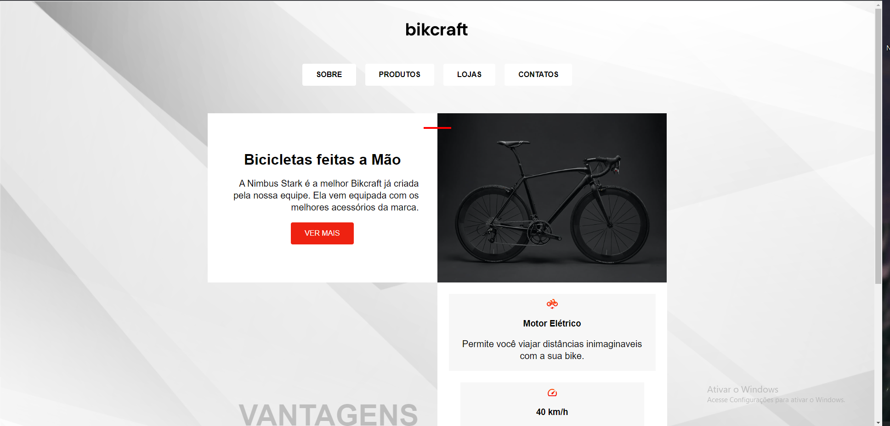
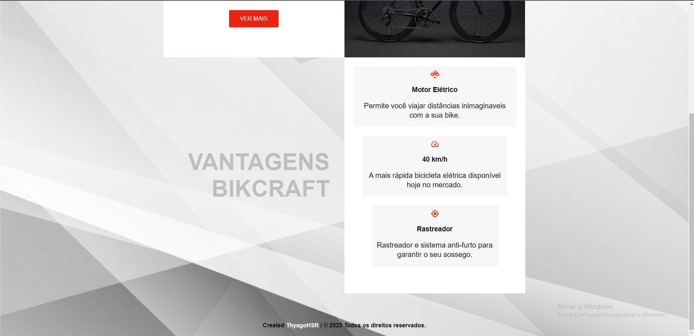
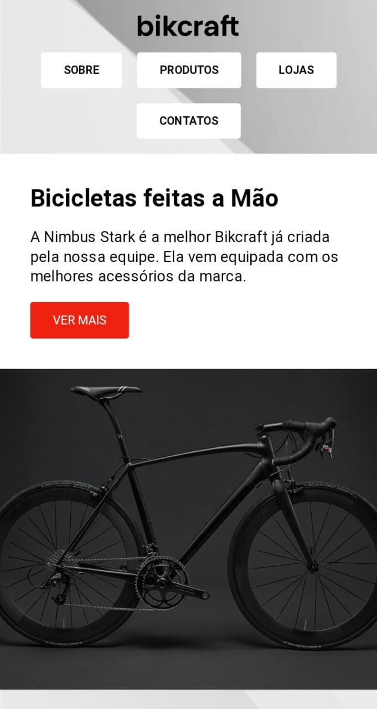
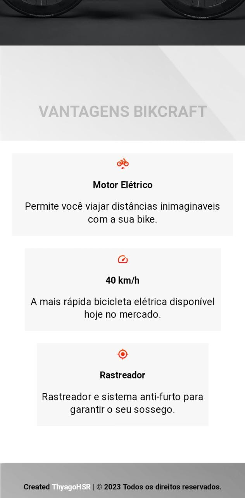

<h1 align=center>

<h2>📄 Sobre o Projeto</h2>
 
• O projeto BikeCraft foi feito a partir do curso Front end e UX UI Design da Origamid onde usei grid layout e flexbox.  • Criado em 29/01/2023.
  
<h1>🖼️ Imagens do Projeto </h1>

  

  

  
<h1>💻 Tecnologias utilizadas</h1>

• HTML

• CSS

• JavaScript

<h1>📝 Licença </h1>

O projeto possui a licença MIT, veja o arquivo LICENSE para mais informações.

  

LinkedIn: https://www.linkedin.com/in/thyagohenrique2021

E-mail: thyagohsr18@gmail.com

